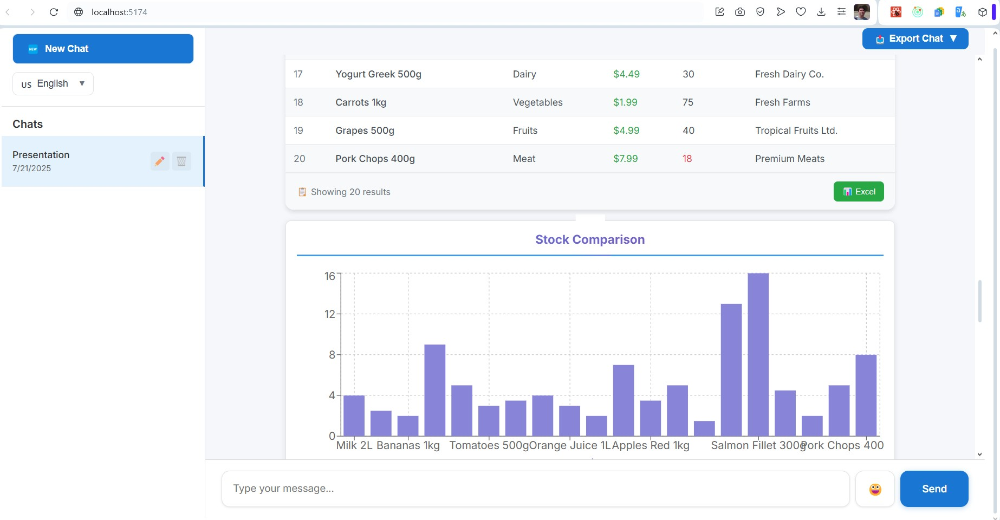

# React MCP Client

A modern React-based client application for interacting with Model Context Protocol (MCP) servers, featuring AI-powered chat interface with Azure OpenAI integration, advanced trace debugging capabilities, comprehensive internationalization support, and powerful data visualization tools.

## 🚀 Features

### 💬 **Core Chat Interface**

- **AI-Powered Chat Interface**: Interactive chat with Azure OpenAI integration
- **MCP Server Integration**: Direct communication with Model Context Protocol servers
- **Advanced Trace Debugging**: Comprehensive trace functionality for AI-MCP request/response flows
- **Chat Session Management**: Create, manage, and export multiple chat sessions
- **Real-time Visual Feedback**: Copy-to-clipboard functionality with visual confirmation
- **Responsive Design**: Modern, mobile-friendly interface with smooth animations

### 🌍 **Internationalization (i18n)**

- **Multi-Language Support**: Full localization for 3 languages
  - 🇺🇸 **English** - Default language
  - 🇫🇷 **French** (Français) - Complete translations
  - 🇳🇱 **Dutch** (Nederlands) - Complete translations
- **Language-Specific Storage**: Separate chat histories for each language
- **Dynamic Language Switching**: Instant UI updates with flag indicators
- **Comprehensive Translation**: All UI elements, error messages, and system prompts

### 📊 **Data Visualization & Export**

- **Smart Table Rendering**: Automatic detection and beautiful rendering of structured data
- **Advanced Chart Visualization**: Multiple chart types for data analysis
  - 📊 **Bar Charts** - For categorical data comparison
  - 🥧 **Pie Charts** - For distribution visualization
  - 📈 **Line Charts** - For trend analysis over time
- **Excel Export**: Professional Excel files with formatting, styling, and metadata
- **Multiple Export Formats**: Export conversations in JSON, Text, Markdown, and Excel formats
- **Interactive Table Controls**: Copy, export, and format tabular data

### 🔍 **Azure Search Integration**

- **RAG Capabilities**: Retrieval-Augmented Generation with Azure Cognitive Search
- **Schema Information**: Dynamic index schema display and field analysis
- **Smart Query Processing**: Intelligent search parameter extraction

### 🧠 Enhanced AI Capabilities

- **Intelligent Parameter Extraction**: AI-powered extraction of thresholds, date ranges, suppliers, and categories
- **Smart Query Classification**: Automatic detection of summary vs detailed data requests
- **Auto-Applied Date Ranges**: Intelligent default date range application for sales and analytics queries
- **Threshold Detection**: Automatic extraction of numeric thresholds from natural language (e.g., "under 30 units")
- **Category Performance Analysis**: Specialized handling for product category performance queries
- **Applied Filter Transparency**: Clear display of all automatically applied filters and parameters

### 📊 Advanced Data Processing

- **Summary vs Detailed Logic**: Intelligent switching between summary totals and detailed breakdowns
- **Revenue Calculation**: Automatic calculation of total revenue with period information
- **Category Analytics**: Enhanced category performance analysis with auto-applied date ranges
- **Low Stock Detection**: Smart detection and filtering of low stock inventory items
- **Supplier Filtering**: Intelligent supplier name extraction and filtering capabilities
- **Real-time Parameter Display**: Live display of applied filters with human-readable date formats

## 🛠️ Technology Stack

- **Frontend**: React 19.1.0 with TypeScript
- **Build Tool**: Vite 7.0.4
- **Styling**: CSS Modules with modern design patterns
- **State Management**: React hooks (useState, useEffect, useRef)
- **HTTP Client**: Axios for API requests
- **Internationalization**: react-i18next with browser language detection
- **Data Export**: XLSX library for Excel export functionality
- **Charts & Visualization**: Recharts library for interactive data visualization
- **Development**: ESLint for code quality

## 📋 Prerequisites

- Node.js (version 16 or higher)
- npm or yarn package manager
- Azure OpenAI account and API key
- Azure Cognitive Search service (optional, for RAG capabilities)
- MCP Server running on port 5000

## 🔧 Installation

1. **Clone the repository**

   ```bash
   git clone <repository-url>
   cd react-mcp-client
   ```

2. **Install dependencies**

   ```bash
   npm install
   ```

   **Key Dependencies Installed:**

   - `react-i18next` - Internationalization framework
   - `i18next-browser-languagedetector` - Browser language detection
   - `xlsx` - Excel file generation and formatting
   - `recharts` - Interactive chart visualization library

3. **Environment Configuration**

   Create a `.env` file in the root directory with the following variables:

   ```env
   # Azure OpenAI Configuration (Required)
   VITE_AOAI_ENDPOINT=https://your-openai-resource.openai.azure.com/openai/deployments/your-model/chat/completions?api-version=2023-05-15
   VITE_AOAI_APIKEY=your-azure-openai-api-key

   # Azure Search Configuration (Optional - for RAG capabilities)
   AZURE_SEARCH_ENDPOINT=https://your-search-service.search.windows.net
   AZURE_SEARCH_APIKEY=your-search-admin-key
   AZURE_SEARCH_INDEX=your-index-name

   # MCP Server Configuration
   VITE_MCP_SERVER_URL=http://localhost:5000
   ```

4. **Start the search proxy server** (if using Azure Search)

   ```bash
   node search-proxy.cjs
   ```

5. **Start the development server**

   ```bash
   npm run dev
   ```

6. **Open your browser**

   Navigate to `http://localhost:5174` (or the port shown in terminal)

## 📱 Application Screenshot



_Modern chat interface with AI-powered MCP server integration and comprehensive trace debugging_

## 🏗️ Project Architecture

### System Architecture Flow

```
┌─────────────┐    ┌─────────────┐    ┌─────────────┐    ┌─────────────┐
│             │    │             │    │             │    │             │
│  Frontend   │───▶│ Azure OpenAI│───▶│  Frontend   │───▶│ MCP Server  │
│  (React)    │    │     API     │    │ Processing  │    │   (Port     │
│             │    │             │    │             │    │   5000)     │
└─────────────┘    └─────────────┘    └─────────────┘    └─────────────┘
       ▲                                       │                  │
       │                                       ▼                  ▼
       │           ┌─────────────┐    ┌─────────────┐    ┌─────────────┐
       │           │             │    │             │    │             │
       └───────────│  Frontend   │◀───│  Frontend   │◀───│   Response  │
                   │  Rendering  │    │ Formatting  │    │  Processing │
                   │             │    │             │    │             │
                   └─────────────┘    └─────────────┘    └─────────────┘
```

**Flow Description:**

1. **User Input** → Frontend captures user query
2. **AI Processing** → Azure OpenAI analyzes intent and generates structured function calls
3. **Parameter Extraction** → Frontend extracts and enriches MCP parameters with AI assistance
4. **MCP Server Call** → Direct HTTP communication with MCP server on port 5000
5. **Response Processing** → MCP server processes request and returns structured data
6. **Smart Formatting** → Frontend applies intelligent formatting (summary vs detailed)
7. **UI Rendering** → Results displayed with tables, summaries, and applied filters

### Project Structure

```
react-mcp-client/
├── public/
│   └── vite.svg                 # Vite logo
├── src/
│   ├── assets/
│   │   ├── react.svg           # React logo
│   │   └── Screen.jpg          # Application screenshot
│   ├── components/
│   │   ├── App.tsx             # Main application component & session management
│   │   ├── App.module.css      # Application-specific styling
│   │   ├── Chat.tsx            # Chat interface, tables, charts & trace debugging
│   │   ├── Chat.module.css     # Chat-specific styling & responsive design
│   │   ├── EmojiPicker.tsx     # Emoji selection component
│   │   ├── EmojiPicker.module.css # Emoji picker styling
│   │   ├── LanguageSelector.tsx # Language switching component
│   │   └── LanguageSelector.module.css # Language selector styling
│   ├── i18n/
│   │   ├── i18n.ts             # i18next configuration & language helpers
│   │   └── locales/
│   │       ├── en.json         # English translations
│   │       ├── fr.json         # French translations
│   │       └── nl.json         # Dutch translations
│   ├── services/
│   │   ├── azureOpenAI.ts      # Azure OpenAI integration & AI parameter extraction
│   │   ├── azureSearch.ts      # Azure Search integration (RAG capabilities)
│   │   └── mcpServer.ts        # MCP server communication & response formatting
│   ├── index.css               # Base styles & CSS variables
│   ├── main.tsx                # Application entry point & React setup
│   └── vite-env.d.ts           # TypeScript environment declarations
├── search-proxy.cjs            # Express proxy for Azure Search (CORS handling)
├── vite.config.js              # Vite configuration & development settings
├── eslint.config.js            # ESLint configuration for code quality
├── tsconfig.json               # TypeScript configuration
├── tsconfig.node.json          # Node.js TypeScript configuration
├── package.json                # Dependencies, scripts & project metadata
└── README.md                   # Project documentation
```

### Key Components

- **`Chat.tsx`** - Core chat interface with AI-powered parameter extraction, trace debugging, table rendering, chart visualization, and Excel export
- **`App.tsx`** - Session management, chat persistence, language-aware storage, and export functionality
- **`LanguageSelector.tsx`** - Multi-language support with flag indicators and dropdown interface
- **`i18n/`** - Complete internationalization infrastructure with translation files for English, French, and Dutch
- **`services/`** - Modular service layer for external integrations (Azure OpenAI, Azure Search, MCP servers)
- **`search-proxy.cjs`** - Backend proxy to handle CORS and Azure Search requests

## 🌟 Advanced Features

### 📊 **Data Visualization**

The application includes sophisticated chart visualization capabilities:

- **Automatic Chart Selection**: AI-powered selection of the most appropriate chart type based on data structure
- **Interactive Charts**: Built with Recharts for responsive, interactive data exploration
- **Chart Types**:
  - **Bar Charts**: Perfect for comparing categories, sales by product, inventory levels
  - **Pie Charts**: Ideal for showing distribution, market share, category breakdowns
  - **Line Charts**: Excellent for trends over time, sales progression, stock movements
- **Customizable Display**: Users can specify chart preferences in queries (e.g., "show as pie chart", "bar chart only")
- **Professional Styling**: Color-coded, responsive charts with tooltips and legends

### 🌍 **Internationalization (i18n)**

Complete multi-language support with advanced features:

- **Language-Specific Storage**: Each language maintains separate chat histories using dedicated localStorage keys
- **Comprehensive Translation Coverage**:
  - All UI elements (buttons, labels, placeholders)
  - System messages and error handling
  - Export functionality and table headers
  - Trace debugging information
- **Dynamic Language Switching**: Instant UI updates when switching languages
- **Browser Language Detection**: Automatically detects and sets user's preferred language
- **Professional Language Selector**: Dropdown interface with country flags and native language names

### 📈 **Excel Export Capabilities**

Professional Excel export functionality:

- **Rich Formatting**: Auto-sized columns, styled headers, alternating row colors
- **Multiple Worksheets**: Data sheet with source information and metadata sheet
- **Comprehensive Metadata**: Export timestamp, source tool, record counts, and column information
- **Smart File Naming**: Automatic generation of descriptive filenames with timestamps
- **Data Preservation**: Maintains data types, formatting, and structure in Excel format

## 🔄 How It Works

### 1. **Enhanced Chat Flow**

```
User Query → AI Intent Analysis → Parameter Extraction → MCP Server Call → Smart Formatting → UI Rendering
```

**Detailed Process:**

1. **User Input Processing**

   - User submits query through the React chat interface
   - Input validation and sanitization
   - Query context building with conversation history

2. **AI-Powered Intent Analysis**

   - Azure OpenAI processes user intent using advanced prompting
   - Generates structured function calls with parameters
   - Extracts tool selection and parameter requirements

3. **Intelligent Parameter Extraction**

   - AI-assisted parameter extraction with threshold detection
   - Auto-applied date ranges for sales/analytics queries
   - Smart supplier and category detection
   - Fallback to direct regex extraction

4. **MCP Server Communication**

   - Direct HTTP communication with MCP server on port 5000
   - Dynamic endpoint selection based on query intent
   - Parameter enrichment and validation
   - Comprehensive error handling and retry logic

5. **Smart Response Formatting**

   - Summary vs detailed response detection
   - Category-aware data processing
   - Automatic table rendering for structured data
   - Applied filter transparency and user feedback

6. **Advanced UI Rendering**
   - Real-time display of applied filters and parameters
   - Interactive table rendering with smart formatting
   - Trace debugging with expandable panels
   - Copy-to-clipboard with visual feedback

### 2. **Advanced Trace Debugging**

The application includes comprehensive trace functionality that captures:

- **User Input**: Original query from the user with intent analysis
- **AI Response**: Full Azure OpenAI response with function calls and reasoning
- **Parameter Extraction**: AI-powered parameter detection with fallback mechanisms
- **MCP Call**: Extracted function name and enriched parameters
- **MCP Response**: Raw response from the MCP server with validation
- **Selected Tool**: The specific tool/function called with endpoint information
- **Applied Parameters**: All processed parameters including auto-applied defaults
- **Response Formatting**: Summary vs detailed logic decisions
- **Filter Transparency**: Display of all applied filters with human-readable formats
- **Timestamp**: Exact time of each request phase
- **Error Handling**: Comprehensive error tracking with debugging context

### 3. **Intelligent Data Rendering**

- **Smart Summary Detection**: Automatic detection of requests for totals vs detailed data
- **Applied Filter Display**: Real-time display of all applied parameters and date ranges
- **Auto-Applied Defaults**: Transparent communication of automatically applied date ranges
- **Category Performance**: Specialized rendering for category-based analytics
- **Revenue Calculations**: Automatic total revenue calculation with period information
- **Mixed Content Support**: Seamless handling of responses with both summaries and detailed tables
- **Interactive Tables**: Beautiful, responsive tables with smart column formatting
- **Low Stock Alerts**: Visual highlighting of inventory items below specified thresholds

## 🎨 UI Features

### Chat Interface

- **Modern Design**: Clean, professional interface with subtle animations
- **Message Types**: Distinct styling for user and AI messages
- **Copy Functionality**: One-click copy with visual feedback
- **Trace Toggle**: Expandable debug panels for each AI response

### Table Rendering

- **Auto-Detection**: Automatic identification of structured data
- **Smart Formatting**: Intelligent formatting for dates, currencies, and IDs
- **Interactive Elements**: Hover effects and responsive design
- **Custom Headers**: Human-readable column headers
- **Color Coding**: Context-aware styling (e.g., low stock warnings)

### Session Management

- **Multiple Chats**: Create and manage multiple conversation sessions
- **Persistent Storage**: Local storage integration for session persistence
- **Export Options**: Export conversations in multiple formats
- **Title Editing**: Rename chat sessions for better organization

## 🔧 Configuration

### Azure OpenAI Setup

1. Create an Azure OpenAI resource in Azure Portal
2. Deploy a chat model (e.g., GPT-4, GPT-3.5-turbo)
3. Obtain the endpoint URL and API key
4. Configure the `.env` file with your credentials

### Azure Search Setup (Optional)

1. Create an Azure Cognitive Search service
2. Create and populate a search index with your MCP tool documentation
3. Configure the search proxy with your credentials
4. Start the proxy server before running the main application

### MCP Server Integration

Ensure your MCP server is running on port 5000 and provides the following:

- RESTful API endpoints for tool functions
- JSON responses with structured data
- Error handling and appropriate HTTP status codes

## 🚀 Available Scripts

- **`npm run dev`** - Start development server with hot reload
- **`npm run build`** - Build for production
- **`npm run preview`** - Preview production build locally
- **`npm run lint`** - Run ESLint for code quality checks

## 🔍 API Integration

### Azure OpenAI Service

Located in `src/services/azureOpenAI.ts`

- Handles structured prompts for MCP function extraction
- Processes AI responses for function call identification
- Error handling and response formatting

### Azure Search Service

Located in `src/services/azureSearch.ts`

- RAG capabilities for enhanced AI responses
- Tool discovery and documentation retrieval
- Fallback mechanisms for offline operation

### MCP Server Communication

Located in `src/services/mcpServer.ts`

- Direct HTTP communication with MCP servers
- Parameter enrichment and query processing
- Response formatting and error handling

## 🎯 Use Cases

- **AI Assistant Development**: Test and debug AI-powered applications
- **MCP Protocol Testing**: Validate MCP server implementations
- **Data Exploration**: Interactive exploration of structured datasets with charts and tables
- **Multi-Language Applications**: Test internationalization and localization features
- **Data Analysis & Reporting**: Export data to Excel for further analysis and reporting
- **API Testing**: Test and document API endpoints through conversational interface
- **RAG System Development**: Build and test retrieval-augmented generation systems

## 🐛 Troubleshooting

### Common Issues

1. **"Azure OpenAI endpoint or API key not set"**

   - Verify your `.env` file contains correct `VITE_AOAI_ENDPOINT` and `VITE_AOAI_APIKEY`
   - Ensure the endpoint URL includes the full path with API version

2. **"No matching MCP tool found"**

   - Check that your MCP server is running on port 5000
   - Verify the search index contains tool documentation
   - Check the search proxy server logs for errors

3. **Table data not rendering**

   - Ensure your MCP server returns data in the expected JSON format
   - Check browser console for JavaScript errors
   - Verify the response structure matches the expected format

4. **Language switching not working**

   - ✅ **NEW FEATURE**: Multi-language support with separate storage
   - Check browser localStorage for language-specific keys (e.g., `chatMessages_fr`)
   - Verify translation files are loading correctly in browser network tab
   - Language selector appears in top-right corner with flag indicators

5. **Charts not displaying**

   - ✅ **NEW FEATURE**: Automatic chart generation based on data structure
   - Ensure data has appropriate structure for visualization (numeric values, categories)
   - Check console for Recharts rendering errors
   - Try specifying chart type in query (e.g., "show as bar chart")

6. **Excel export not working**

   - ✅ **NEW FEATURE**: Professional Excel export with formatting
   - Check browser's download folder for generated Excel files
   - Verify XLSX library is properly loaded (check browser console)
   - Ensure data table is visible before attempting export

7. **Applied filters not visible**

   - ✅ **FIXED**: Applied filters are now displayed above table data
   - Date ranges are shown in both human-readable (6/13/2025) and ISO formats (2025-06-13)
   - Auto-applied defaults are clearly marked with explanatory notes

8. **Parameter extraction issues**

   - ✅ **ENHANCED**: AI-powered parameter extraction with comprehensive examples
   - Threshold detection for queries like "under 30 units"
   - Smart supplier and category name extraction
   - Fallback to regex-based extraction when AI extraction fails

9. **Category performance HTTP 400 errors**

   - ✅ **RESOLVED**: Auto-applied 30-day date ranges for category queries
   - Enhanced parameter validation and debugging
   - Clear error messages with parameter validation details

10. **Summary vs detailed data confusion**

    - ✅ **IMPLEMENTED**: Smart detection of summary vs detailed requests
    - Revenue queries automatically show totals and summaries
    - Category breakdowns show detailed data with applied filters
    - Clear indicators of which format is being used

11. **Trace panel not showing**
    - Click the checkbox next to the copy button to toggle trace visibility
    - Check that the message contains `traceData` in the response
    - Enhanced trace data now includes parameter extraction debugging

### Debug Mode

Enable trace debugging by clicking the trace checkbox next to any AI response. This will show:

- Complete request/response flow
- Parameter processing details
- Error messages and stack traces
- Performance timing information

## 🤝 Contributing

1. Fork the repository
2. Create a feature branch (`git checkout -b feature/amazing-feature`)
3. Commit your changes (`git commit -m 'Add some amazing feature'`)
4. Push to the branch (`git push origin feature/amazing-feature`)
5. Open a Pull Request

## 📄 License

This project is licensed under the MIT License - see the LICENSE file for details.

## 🔗 Related Resources

- [Model Context Protocol Documentation](https://modelcontextprotocol.io/)
- [Azure OpenAI Documentation](https://docs.microsoft.com/en-us/azure/cognitive-services/openai/)
- [Azure Cognitive Search Documentation](https://docs.microsoft.com/en-us/azure/search/)
- [React Documentation](https://react.dev/)
- [Vite Documentation](https://vitejs.dev/)
- [react-i18next Documentation](https://react.i18next.com/)
- [Recharts Documentation](https://recharts.org/)
- [XLSX Documentation](https://sheetjs.com/)

## 🆘 Support

For questions, issues, or contributions, please:

1. Check the troubleshooting section above
2. Review existing GitHub issues
3. Create a new issue with detailed information about your problem
4. Include environment details, error messages, and steps to reproduce

---

**Built with ❤️ using React, TypeScript, and the Model Context Protocol**

_Features: Multi-language support (🇺🇸🇫🇷🇳🇱) • Excel Export • Interactive Charts • Advanced Data Visualization_
